# LINE Pay v3 ハンズオン資料 [Version. 2019.11.03]

## 1-1. LINE Pay とは

LINE Payは、LINEのユーザーがLINE Pay加盟店のサイトで利用できる決済システムです。
ユーザーがLINE Payを使って支払いをするには、決済を行うサイトがLINE Pay加盟店である必要があります。

### LINE Pay の加盟店申請

#### 個人でも加盟店申請できる

LINE Pay の加盟店になるには法人でなくとも大丈夫です。個人で加盟店申請するには、個人事業主として開業届を出して青色申告をしてあればOKです。
LINE Pay 公式の「よくある質問」にも、個人事業主でも加入できると書いてあります。

[個人事業主も加入できますか？：よくある質問＠LINE Pay](https://pay.line.me/jp/intro/faq?locale=ja_JP&sequences=14)

**その他、詳しい申請方法は [LINE API HANDBOOK](https://miso-develop.booth.pm/items/1573526) の第11章に書いてありますので、ぜひ読んでください！**


## 「Checkout」を利用した際の決済処理の流れ

LINE Payで提供する多様な決済手段(残高、クレジットカード、銀行口座、LINEポイント)と、LINEのユーザー情報（Profile+）を利用することで、決済と注文や配送方法の選択などを簡単に行うことができます。

### 2-1. Checkout を利用した決済の流れ

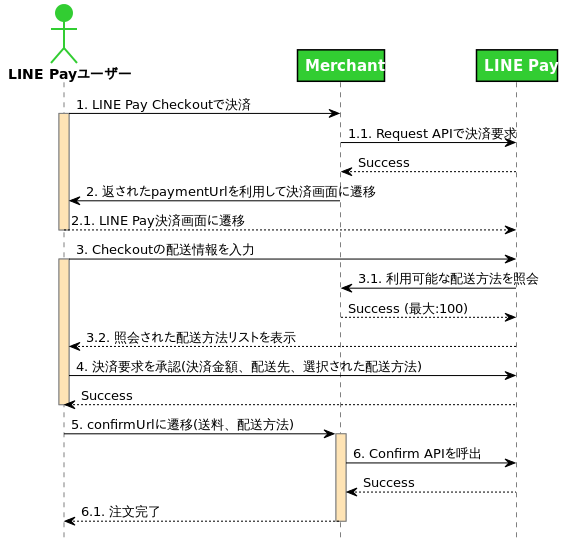

#### 1 決済リクエスト

LINE Pay 決済を行う前に、サービスプロバイダーの状態が正常であるかを判断し、決済をリクエストします。
この際、加盟店側は配送方法と送料を照会できるAPI (Inquiry ShippingMethods API) を実装して、LINE Pay 側に提供する必要があります。
リクエスト成功したら、決済完了/払い戻しするまで使用する「取引番号（transactionId）」と、決済を実行する「決済URL（paymentUrl）」が発行されます。

#### 2 承認画面への遷移

「決済URL（paymentUrl）」を利用してユーザーをLINE Pay 決済画面へ遷移させます。

#### 3 ユーザーによる決済方法などの選択・確認

画面が決済URLへ遷移後、ユーザーはLINEアプリの決済画面で注文した商品と決済情報（金額など）を確認し、配送先を指定します。
この際に表示される配送方法は、1 で実装したAPI (Inquiry ShippingMethods API) が提供する配送方法の情報（名称、送料、配送予定日）が表示されます。

#### 4 ユーザーによる決済の承認

ユーザーは配送方法と決済手段を選択し、決済リクエストを承認します。

#### 5 決済リクエスト承認の返却

ユーザーにより決済リクエストが承認されれば、決済リクエスト時に加盟店が指定したconfirmUrl に配送方法と送料の情報が追加されて遷移します。

#### 6 承認実行

加盟店はConfirm API を実行して決済を完了させます。


## LINE Pay Sandboxの申請と設定

実際に決済するには加盟店登録が必要ですが、開発して動作を確認するフェーズであればSandbox が利用できます。こちらは下記のURLから申請すると、Sandbox 用のLINE Pay API アカウントが払い出されますので、誰でもすぐに利用できます。

**今回のハンズオンでは予めSandbox 環境を準備頂いていますので、下記のステップは不要です。**
**ハンズオン後に、お手元で開発等を行われる際に申請が必要となりますので、ご参照ください。**

### 3-1. LINE Pay Sandboxの申請


[こちら](https://pay.line.me/jp/developers/techsupport/sandbox/creation?locale=ja_JP) からSandbox環境の利用申請ができます。
メールアドレスを入力して「Submit」ボタンを押下するとアカウント情報が払い出されます。

### 3-2. キー情報の確認

アカウントが払い出されたら[LINE Pay コンソール](https://pay.line.me/login/) の決済連動管理 > 連動キー管理からChannel ID とChannel Secret Key を確認します。これらの値はLINE Pay のAPI コールに必要になります。
メモしておいてください。
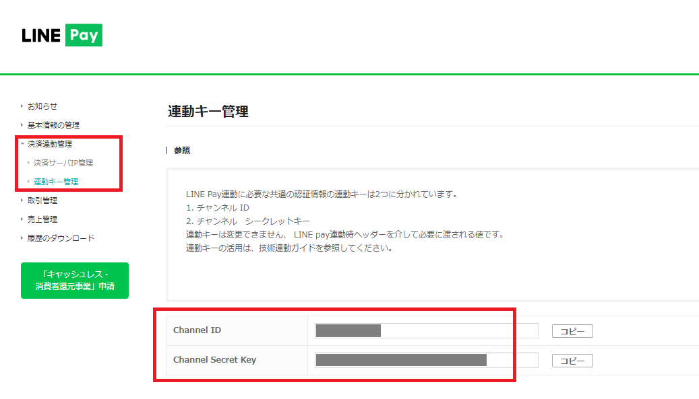

### 3-3. 技術ドキュメント

LINE Pay API の詳細な情報は、[ここ](https://pay.line.me/jp/developers/apis/onlineApis?locale=ja_JP) にあります。


## ngrok の実行

### 4-1. ngrok を実行する

新規にターミナルまたはコマンドプロンプト（Powershell）を起動して、ngrok を実行する

```bash
$ ngrok http 5000
```

ngrok が起動したら「Forwarding」のURL（HTTPSの方）をメモしておく

```bash
ngrok by @inconshreveable                                                                                                                                                                                                                    (Ctrl+C to quit)

Session Status                online
Session Expires               7 hours, 28 minutes
Update                        update available (version 2.3.34, Ctrl-U to update)
Version                       2.3.18
Region                        United States (us)
Web Interface                 http://127.0.0.1:4040
Forwarding                    http://xxxxxx.ngrok.io -> http://localhost:5000
Forwarding                    https://xxxxxx.ngrok.io -> http://localhost:5000
```

## チャネルの作成

### 5-1. LINE Developers にログイン

[LINE Developers](https://developers.line.biz/ja/) にアクセスしてログイン


### 5-2. プロバイダーを選択

任意のプロバイダーを選択
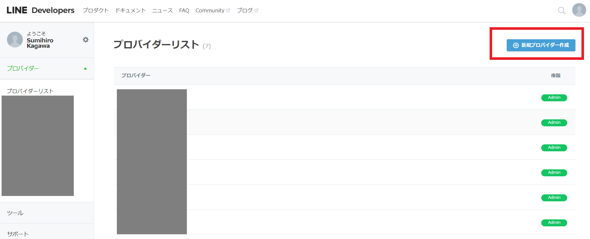


#### プロバイダー未作成の人は画面右上の「新規プロバイダー作成」ボタンを押下して新規作成してください。

*任意の「プロバイダー名」を入力して作成*

### 5-3. チャネルを新規作成

#### Botのチャネルを作成


#### 「Messaging API」 を選択


#### チャネル情報を入力

チャネル情報を入力して、「入力内容を確認する」ボタンを押下する。

##### チャネル情報の入力例

- アプリ名
    - HandsOnPayBot
- アプリ説明
    - LINE  Pay ハンズオン
- 大業種
    - 個人
- 小業種
    - 個人（その他）
- メールアドレス
    - （ご自分のメールアドレス）

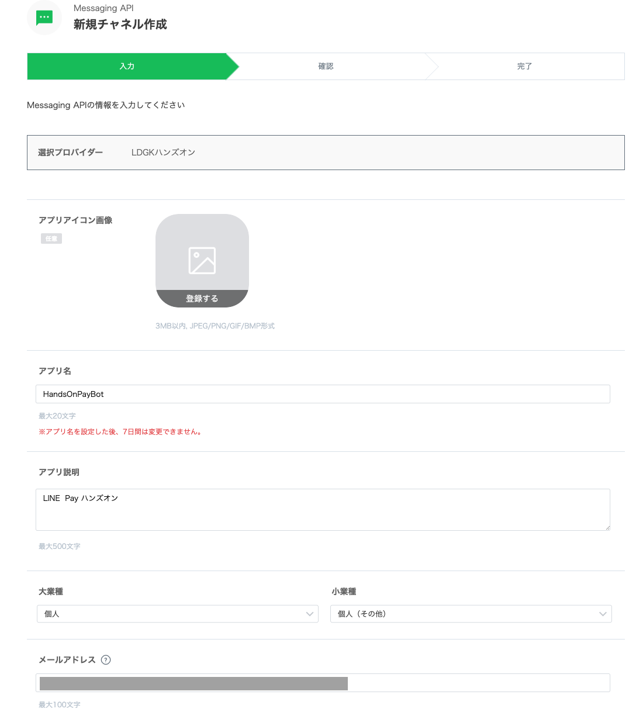

#### 各種規約に同意してチャネルを作成する


## チャネルの設定

### 6-1. チャネル基本情報画面を開く

作成したチャネルを選択してチャネル基本情報画面を開く

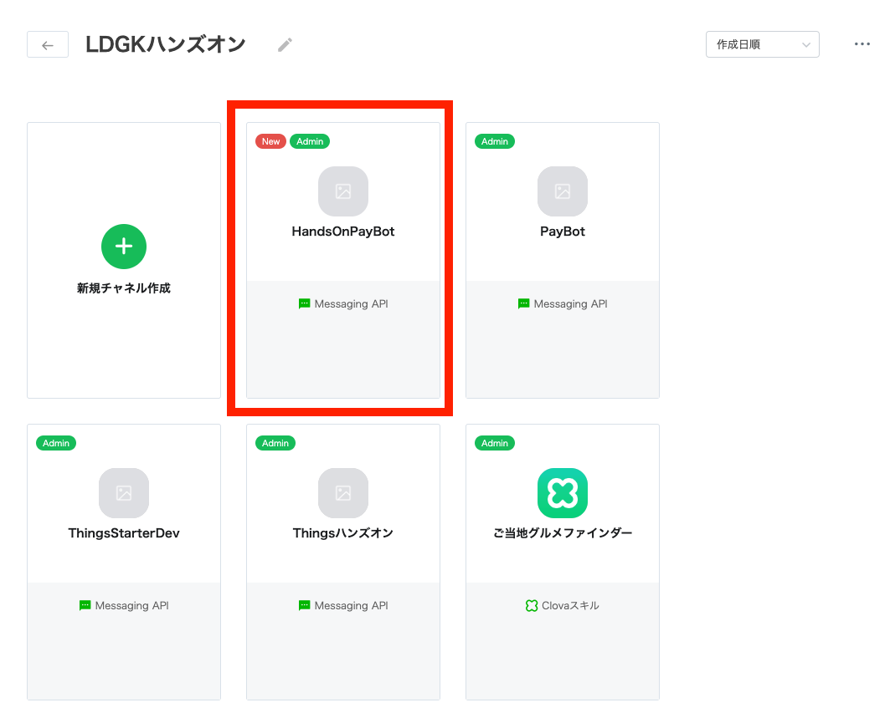

### 6-2. Channel Secret をメモしておく

チャネル基本情報画面に表示されているChannel Secret をメモしておく


### 6-3. アクセストークン を発行してメモしておく

アクセストークンの「再発行」ボタンを押下して発行し、メモしておく


### 6-4. Webhook 設定

Webhook送信 を「利用する」に設定して更新ボタンを押下する

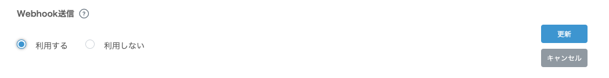

### 6-5. Webhook URL設定

Webhook URL に4-1 でメモした **ngrok のURL + /bot を入力して** 更新ボタンを押下する

- "https://" は入力不要です


### 6-6. 自動応答メッセージ設定

自動応答メッセージ の画面右側にある「設定はこちら」リンクを押下して、公式アカウントマネージャー画面を開く

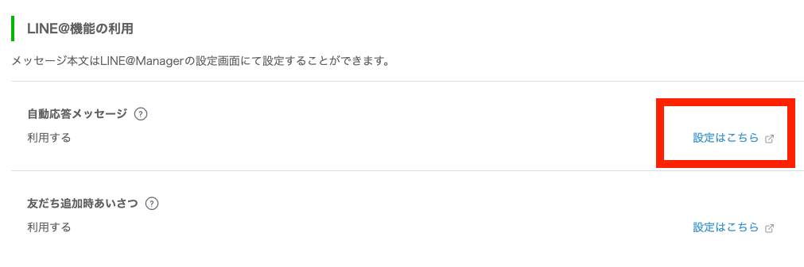

応答設定の詳細設定

- 応答メッセージ
    - オフ
- Webhook
    - オン


### 6-7. 作成したBotのチャネルを友だち登録する

LINEアプリへのQRコードをLINEアプリで読み込んで友だち登録する

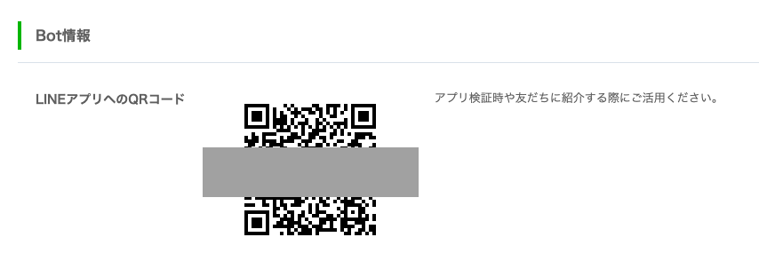

## リッチメニューの設定


### 7-1. リッチメニューを作成する

Bot の画面に表示するメニュー（リッチメニュー）の表示設定をします

公式アカウントマネージャーの「ホーム」タブ→「リッチメニュー」を選択し、リッチメニューの「作成」ボタンを押下する


### 7-2. リッチメニューの表示設定

リッチメニューのタイトルと、表示期間を入力する

入力例）

- タイトル
    - リッチメニュー
- 表示期間
    - 2019/11/01  00:00
    - 2021/01/01  00:00


### 7-3. リッチメニューのテンプレート設定

リッチメニューの大きさと、ボタン領域・数を設定する


コンテンツ設定 の左側にある「テンプレートを選択」を押下して、リッチメニューのテンプレートタイプを選択する


今回は右下にある、サイズ小で、ボタン領域が２つあるテンプレートを選択する

### 7-5. リッチメニューのアクション設定

ユーザーがリッチメニューを押下した際の挙動を設定する

今回は、各領域選択時にテキストメッセージが送信されるように設定する

左側の領域選択時に「アイテム」、右側領域選択時に「カート」というテキストメッセージが送信されるよう、下記のように設定する

- 領域A
    - タイプ：テキスト
    - テキスト：アイテム
- 領域B
    - タイプ：テキスト
    - テキスト：カート


### 7-6. リッチメニューの背景画像設定

リッチメニュー領域に表示させる画像を設定する

コンテンツ設定 の左側にある「背景画像をアップロード」を押下して、画像をアップロードする


リッチメニュー用の画像は、images/RichMenu.png を利用する

### 7-7. リッチメニューの保存

すべて設定できていれば、画面したの「保存」ボタンが有効化されるので、ボタンを押下して設定を保存する

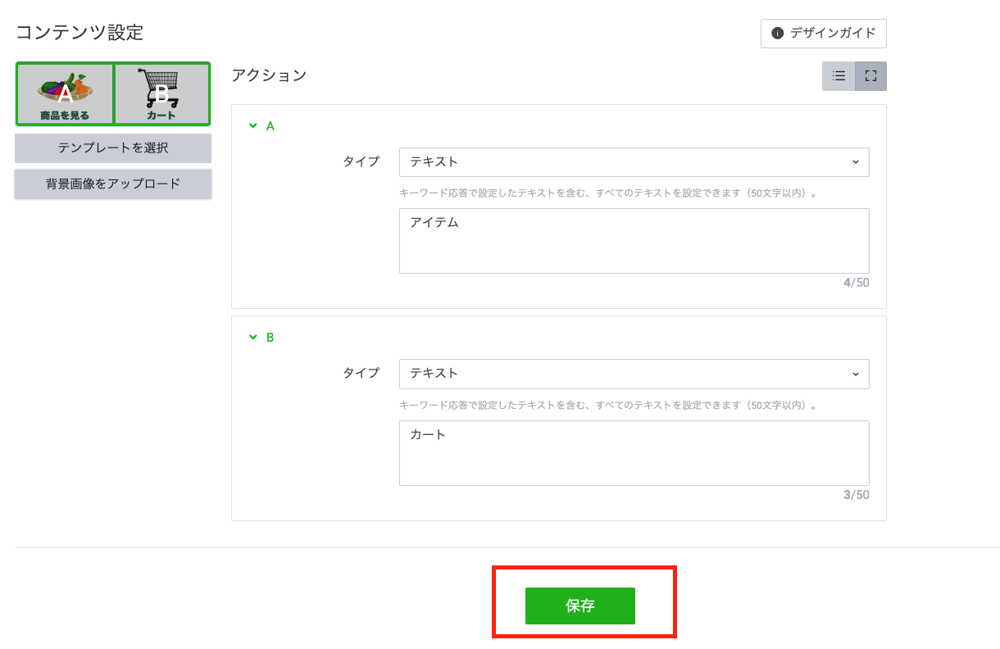

LINE アプリでBot を表示すると、画面下にリッチメニューが表示されます


## 実装と実行

### 8-1. git clone

ハンズオン用に適当なディレクトリを作成して、そこへソースコードをgit clone する

クローンできたら、ダウンロードしたディレクトリをVisualStucioCode で開いておく

#### Mac

```bash
$ mkdir ~/line-pay-hands-on && cd ~/line-pay-hands-on
$ git clone https://github.com/sumihiro3/hands-on-line-pay-v3.git
$ cd hands-on-line-pay-v3
```

#### Windows

```bat
> mkdir c:¥tmp¥line-pay-hands-on
> cd c:¥tmp¥line-pay-hands-on
> git clone https://github.com/sumihiro3/hands-on-line-pay-v3.git
> cd hands-on-line-pay-v3
```

#### git clone 出来ない場合はリポジトリ内容をZIPファイルでダウンロード

git clone 出来ない場合は、[リポジトリのページ](https://github.com/sumihiro3/hands-on-line-pay-v3.git)にアクセスして、ページ右側の「Clone or download」ボタンを押下、「Download ZIP」ボタンを押下してリポジトリのZIPファイルをダウンロードし、適当なディレクトリに展開してください。


### 8-2. プログラムに必要なモジュールをインストール

```bash
$ npm install
```

### 8-3. メモしておいた設定を、設定ファイルに記入する

**.env_sample ファイルを.env にリネーム** し、.env ファイルに設定を記入する

```
LINE_PAY_CHANNEL_ID=XXXXXXX
LINE_PAY_CHANNEL_SECRET=XXXXXXXXXXXXXXXXXXXXXXXXXXXX
LINE_PAY_USE_CHECKOUT=true
LINE_BOT_CHANNEL_SECRET=XXXXXXXXXXXXXXXXXXXXXXXXXXXXX
LINE_BOT_ACCESS_TOKEN=XXXXXXXXXXXXXXXXXXXXXXXXXXXXXXXXXXXXXXXXXXXXXXXXXXXXXXXXXXXXXXXX
APP_HOST_NAME=xxxxxxxx.ngrok.io
```

- LINE_PAY_CHANNEL_ID
    - LINE Pay のChannel ID
- LINE_PAY_CHANNEL_SECRET
    - LINE Pay のChannel Secret
LINE_PAY_USE_CHECKOUT
    - true
        - **LINE Pay 残高がない場合は false を指定してください**
- LINE_BOT_CHANNEL_SECRET
    - LINE Bot のChannel Secret
- LINE_BOT_ACCESS_TOKEN
    - LINE Bot のアクセストークン
- APP_HOST_NAME
    - ngrok のURL

### 8-4. プログラムを起動

```bash
$ npm run start
```

## Profile+ の設定

### 9-1. LINE Profile+ とは

あらかじめLINE に登録しておいたプロフィール情報を外部のサイトやLINE の関連サイトで利用できるサービスのこと。
LINE Pay のCheckout では、配送先を指定する際に利用できます。

個々のサービスでの登録ではなく、LINE Checkout などを利用したサービスで共通して利用できる情報となるので、煩わしい入力が不要となります。

### 9-2. LINE Profile+ の設定方法

LINE アプリの「ホーム」→「設定（歯車アイコン）」→「プロフィール」→「LINE Profile+」と遷移すると設定画面が表示されます。


上記のLINE Profile+ 画面が表示されるので「はじめる」をタップして、必要な情報を入力します。

- 氏名（漢字とフリガナ）
- 住所（郵便番号と詳細住所）


## BotでLINE Pay を試してみよう

### 10-1. 商品を選択する

LINE アプリで作成したBot のトーク画面を開く


画面下部のリッチメニューで、左側の「商品を見る」を選択すると商品一覧が表示される


任意の商品の個数を選択すると、カートに投入される

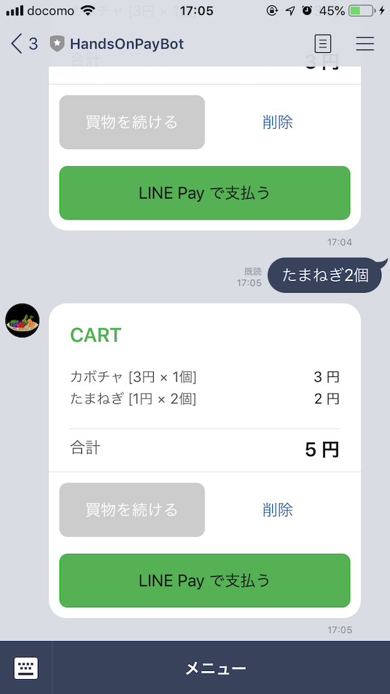

*複数の商品をカートに投入し、まとめて決済することも可能です*

### 10-2. LINE Pay 決済を体験

カートにある「LINE Pay で支払う」ボタンを押下すると決済が始まる


このボタンを押下するとLINE Pay の決済リクエストAPI が実行される

レジが表示されるので、「LINE Pay で決済」ボタンを押下すると、決済リクエストAPI で返された「決済URL（paymentUrl）」のページ（LINE Pay の決済画面）にアクセスする

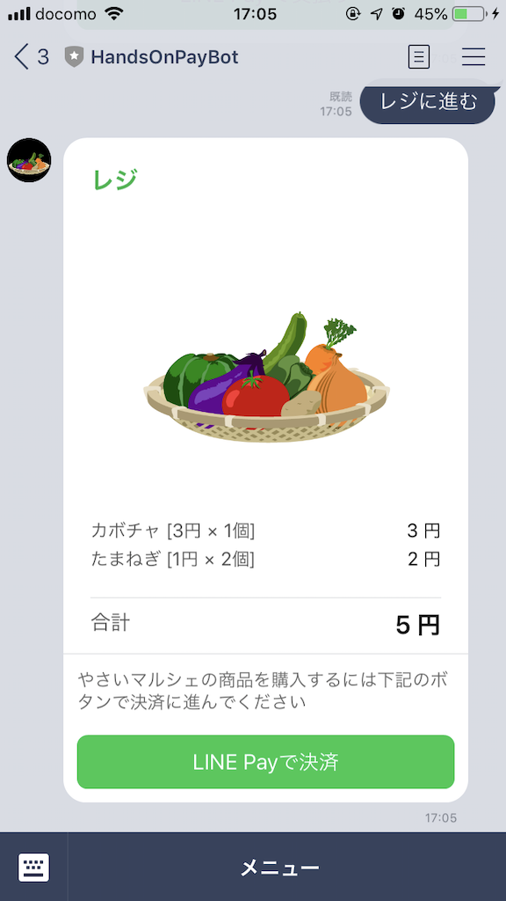

LINE Pay の決済画面では選択した商品が表示される

複数選択した場合は、それぞれの数量と金額も表示される

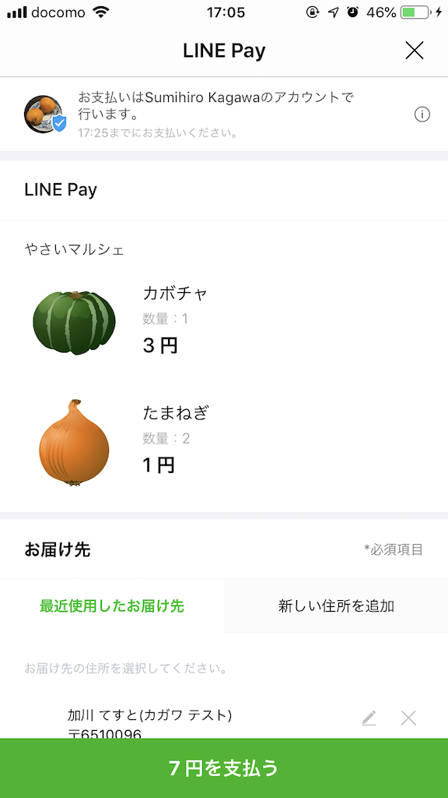

また、画面中ほどでお届け先が設定できる

初期値として、LINE Profile+ で設定した氏名などが予め入力されている


お届け先の下では配送方法が選択できる

ここに表示されている配送方法は、Inquiry ShippingMethods API を実装することで、加盟店側が配送先や購入品に応じて任意の配送方法を表示することができる


配送情報などが問題なければ「XX円を支払う」ボタンを押下して最終確認へ進む


内容を確認して「決済」ボタンを押下して決済を承認する


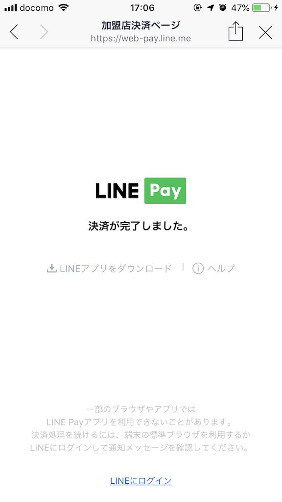

決済が完了すると、サーバーサイドのConfirm URL へWebhook が送信される

承認実行（confirm API）を行うと決済が完了し、トーク画面へメッセージを送信します（Push API）

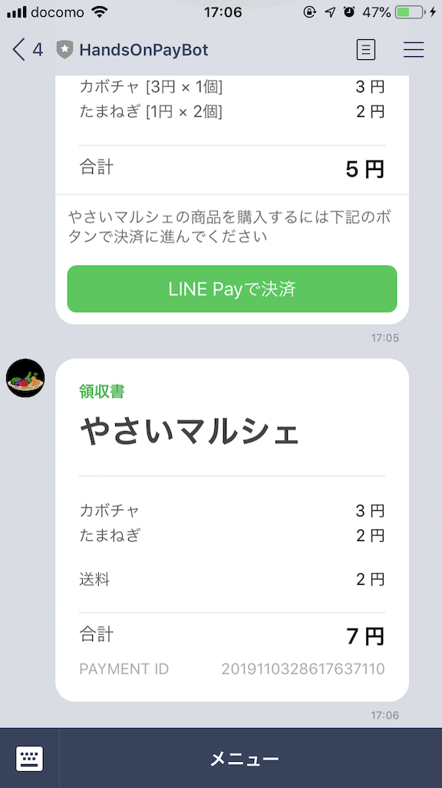
